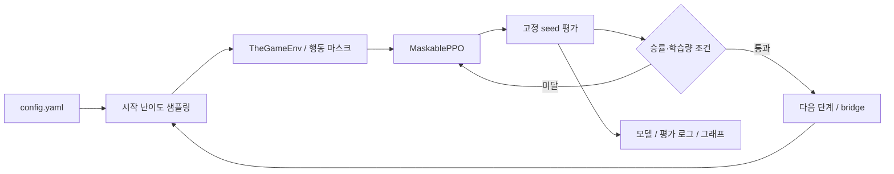
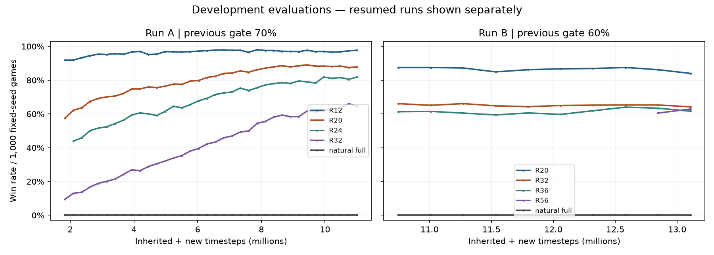

# The Game — Replay Reverse Curriculum

## 프로젝트 소개

**완승에만 보상을 주는 카드게임에서, 쉬운 후반 상태부터 학습 범위를 넓히는 강화학습 프로젝트입니다.** 새 난이도로 넘어갈 때 이전 능력을 잃지 않도록 과거 난이도를 함께 학습하고, 난이도별 승률로 진급을 결정합니다.

`R32`는 원래 98장 게임에서 **32장이 남은 도달 가능한 상태**를 뜻합니다. 목표는 게임 규칙과 보상을 유지하면서 더 긴 게임을 학습하는 것입니다.

## 핵심 특징

- **Sparse reward:** 완승 1, 패배·중간 행동 0. 합법 행동 마스크를 사용하는 MaskablePPO로 학습합니다.
- **Replay curriculum:** 매 에피소드의 시작 난이도를 현재·과거 단계에서 샘플링합니다.
- **승률 기반 진급:** 현재·직전·과거 난이도의 승률과 최소 학습량을 함께 확인합니다.
- **실제 게임으로 전환:** reverse R98 이후 무작위 전체 게임의 비중을 높이는 bridge를 구현했습니다.
- **실험 추적:** 평가 승률·신뢰구간·설정·체크포인트와 개발 평가 스냅샷을 남깁니다.

## 아키텍처



Python · Gymnasium · PyTorch · Stable-Baselines3 / sb3-contrib · NumPy · Matplotlib

| 파일 | 역할 |
| --- | --- |
| `the_game_env.py` | 게임 규칙, reverse 상태 생성, 관측·행동 마스크 |
| `curriculum.py` | 난이도 분포와 진급 조건 |
| `train_replay_curriculum.py` | 학습·평가·진급·모델 저장 |
| `evaluate.py`, `random_baseline.py` | 모델·무작위 정책 평가 |
| `plot_history.py` | 실행별 승률 그래프 |
| `tests/` | 환경 불변조건과 학습 제어 흐름 검증 |

## 빠른 시작

Linux / Python 3.12 기준입니다. 사전학습 모델 없이 실행할 수 있습니다.

```bash
./run_train.sh --from-scratch --quick
```

가상환경과 의존성을 준비한 뒤 128 timestep을 학습하고, 각 평가 난이도에서 학습 전후 4판씩 실행합니다. 성능 측정용이 아닌 실행 확인용입니다. 출력 경로는 시작 로그의 `Output directory`에 표시됩니다.

```bash
.venv/bin/python -m unittest discover -s tests -v
```

테스트 17개 중 원본 모델·소스 ZIP과 비교하는 2개는 해당 로컬 파일이 없으면 건너뜁니다. 모델과 원본 학습 로그는 저장소에 포함하지 않습니다.

## 관측 결과

| 개발 평가 시점 | R20 승률 | 현재 난이도 승률 | 무작위 전체 게임 |
| --- | ---: | ---: | ---: |
| A: R24 시작 | 62.2% | R24 43.9% | 0.0% |
| A: R24 진급 | 74.8% | R24 60.6% | 0.0% |
| A: R32 진급 | 89.0% | R32 61.7% | 0.0% |
| B: R56 진급 | 84.0% | R56 62.9% | 0.0% |



고정 seed 1,000판씩 평가한 결과입니다. B는 A의 R36 모델에서 재개하며 직전 난이도 진급 기준을 70%에서 60%로 낮췄습니다. 두 실행은 통제된 비교 실험이 아닙니다.

더 긴 reverse 난이도로 진행하며 R20 승률을 유지하는 양상을 관측했습니다. **무작위 전체 게임으로의 전이, replay 자체의 효과, 새로운 seed에서의 일반화는 아직 입증하지 않았습니다.**

## 상세 문서

- [설계](docs/design.md): 환경 계약, 상태 생성, 설계 선택과 한계
- [실행 가이드](docs/usage.md): 학습·평가·재개, 설정과 출력 파일
- [실험 기록](docs/experiments.md): 데이터 출처, 평가 조건과 후속 검증
